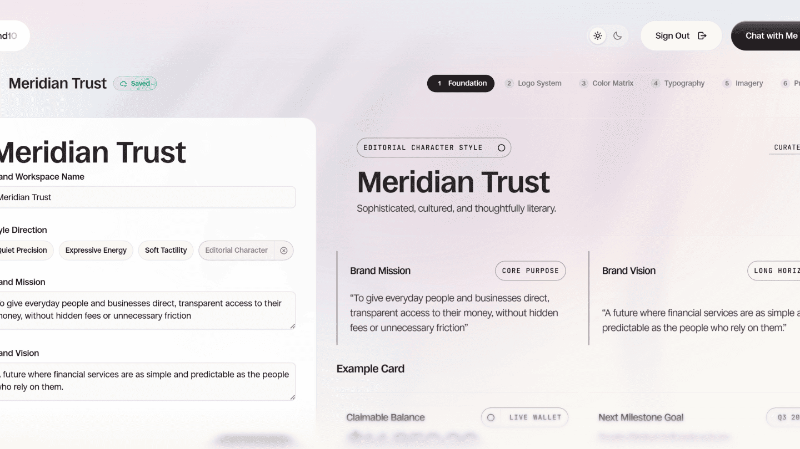
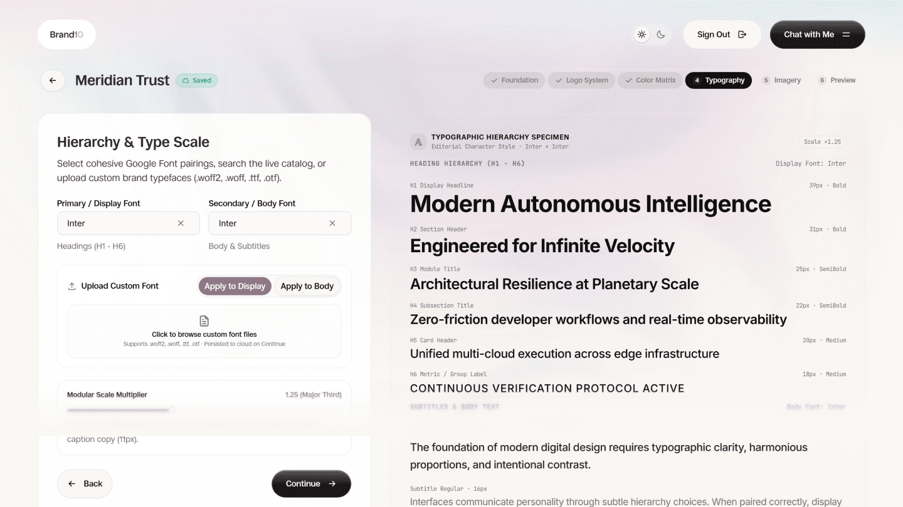
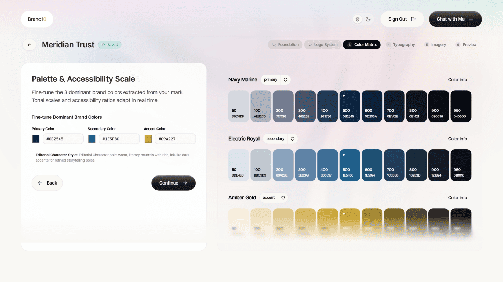

# Brand10 (Brand Studio)

> An open source, high-craft brand identity studio and design system builder for modern engineering and design teams.

[](https://opensource.org/licenses/MIT)
[](https://www.typescriptlang.org/)
[](https://react.dev/)
[](https://vitejs.dev/)
[](https://tailwindcss.com/)
[](CONTRIBUTING.md)

Brand10 transforms raw brand inputs (logos, color codes, typographic ideas, and core values) into production-grade design systems and comprehensive brand manuals. Build, preview, test, and export your entire design system in seconds: complete with WCAG/APCA color contrast validation, responsive typography scales, Tailwind CSS v4 configurations, CSS variables, W3C design tokens, and exportable PDF brand decks.

---

## Visual Showcases

Explore the three central pillars of the Brand10 workflow: **Foundationn**, **Typographyy**, and **Colorss**.

### 1. Foundationn: Identity Architecture & Geometry

Establish clearspace boundaries, logo usage rules, brand voice archetypes, tone ratings, and core values. Upload vector SVGs to extract geometry rules and minimum sizing requirements automatically.



- **Vector SVG & Raster Ingestion**: Automatically inspect SVG nodes or raster files to extract geometry, primary markers, and brand bounding boxes.
- **Clearspace & Sizing Engine**: Define minimum dimensions, protective exclusion zones, and aspect ratio guardrails.
- **Voice & Tone Sliders**: Rate brand attributes across multidimensional spectrums (Formal vs. Casual, Playful vs. Serious, Modern vs. Classic).
- **Usage Rules & Guardrails**: Document strict "Do's and Don'ts" for logo placement, monochromatic adaptations, and background contrast.

---

### 2. Typographyy: Modular Type Scales & Font Pairing

Curate type systems with dynamic Google Fonts integration, responsive modular scales, and mathematical hierarchy for headings, body text, and code.



- **Modular Scale Ratios**: Choose from standardized typographic ratios including Minor Second (1.067), Major Second (1.125), Major Third (1.250), Perfect Fourth (1.333), and Golden Ratio (1.618).
- **Dynamic Google Fonts Loader**: Search and live-preview thousands of Google Font families with instant browser stylesheet injection.
- **Tri-Role Pairing**: Specify harmonized typeface selections for Display/Headings, Body/Editorial, and Code/Technical copy.
- **Micro-Typography Controls**: Fine-tune letter spacing, line heights, font weights, and tracking across mobile, tablet, and desktop breakpoints.

---

### 3. Colorss: Algorithmic Palettes & Accessibility

Extract distinct colors from brand assets and generate complete 50 to 950 tonal shades with automated WCAG 2.1 and APCA accessibility auditing.



- **Vector & Cluster Color Extraction**: Intelligent palette extraction via Chroma.js and ColorThief, grouping distinct hues while removing visual noise.
- **Tonal Scale Generation**: Automated 10-step tonal luminance ramp (50, 100, 200, 300, 400, 500, 600, 700, 800, 900, 950) generated in perceptually uniform color spaces.
- **Automated Accessibility Auditing**: Real-time evaluation of WCAG 2.1 AA and AAA contrast compliance ratios along with APCA perceptual readability ratings.
- **Semantic Role Mapping**: Assign tokens to functional roles including Primary, Secondary, Accent, Neutral, Surface, Success, Warning, and Destructive.

---

## Core Features

- **Interactive Studio Canvas**: Real-time studio environment for tweaking palettes, typography, and foundational guidelines with instant interactive preview cards.
- **Multi-Archetype Style Presets**: Built-in visual direction presets spanning Minimalist, Neo-Brutalist, Semi-Flat, Neumorphism, and Maximalism.
- **Multi-Format Asset Exporter**:
  - **PDF Brand Deck**: High-fidelity, multi-page print-ready brand manual compiled client-side with `@react-pdf/renderer` and `jspdf`.
  - **Tailwind CSS v4 Configuration**: Production-ready configuration compatible with modern `@tailwindcss/vite`.
  - **CSS Custom Properties**: Standardized CSS variables token sheet (`:root { --color-primary-500: ... }`).
  - **W3C Design Tokens**: Industry-standard JSON tokens formatted for Figma, Style Dictionary, and tokens studio.
  - **Complete ZIP Package**: One-click download bundling tokens, configs, guidelines, and vector files using `jszip` and `file-saver`.
- **AI Brand Consultant (BYOK)**: Optional Bring-Your-Own-Key streaming AI assistant powered by client-side WebCrypto encryption. Get suggestions for brand mission statements, tone calibration, and palette harmonies without exposing API keys to third-party servers.
- **Local-First with Cloud Sync**: Full offline capability via IndexedDB (`idb-keyval`) with optional Supabase synchronization backed by Row Level Security (RLS).
- **Time-Travel State Management**: Full undo and redo history support across all studio modifications powered by Zustand and Zundo.

---

## Tech Stack

Brand10 is built on a modern, high-performance TypeScript and React stack:

| Category                       | Technologies                                                       | Description                                                                |
| :----------------------------- | :----------------------------------------------------------------- | :------------------------------------------------------------------------- |
| **Framework & Engine**         | React 19, TypeScript 5+, Vite 8                                    | Modern React architecture with fast Vite HMR and strict typing             |
| **Routing & Navigation**       | TanStack Start, TanStack Router                                    | File-based, type-safe routing with devtools integration                    |
| **Styling & Design System**    | Tailwind CSS v4, Vanilla CSS Tokens                                | Zero-runtime CSS v4 engine paired with scoped design tokens                |
| **UI Components & Primitives** | Base UI (`@base-ui/react`), shadcn/ui                              | Accessible headless primitives and styled component patterns               |
| **Iconography**                | Tabler Icons (`@tabler/icons-react`), Boxicons (`@boxicons/react`) | Comprehensive SVG icon libraries for studio controls                       |
| **Animation & Motion**         | GSAP 3, Lenis Smooth Scroll, `tw-animate-css`                      | Fluid timeline animations, parallax cards, and inertial scrolling          |
| **Color & Graphic Engine**     | Chroma.js, ColorThief, `html-to-image`                             | Perceptual color manipulation, raster palette extraction, canvas rendering |
| **Document & Asset Export**    | `@react-pdf/renderer`, jsPDF, JSZip, FileSaver                     | Client-side PDF compilation, token generation, and ZIP packaging           |
| **State & Persistence**        | Zustand 5, Zundo, `idb-keyval`                                     | Local store, undo/redo middleware, and IndexedDB caching                   |
| **Cloud & Backend (Optional)** | Supabase (`@supabase/supabase-js`)                                 | Authentication, user project storage, and Row Level Security               |
| **Testing & Quality**          | Vitest, Testing Library, ESLint 9, Prettier                        | Unit and component testing suite, code formatting, and linting             |

---

## Project Structure

```
brand-studio/
├── public/
│   ├── showcases/          # Showcase preview assets (Foundationn, Typographyy, Colorss, etc.)
│   ├── fonts/              # Local web font fallbacks
│   └── Brand10.svg         # Brand10 vector logomark
├── src/
│   ├── components/
│   │   ├── dashboard/      # Project management, creation, and user dashboard views
│   │   ├── shared/         # Reusable panels, magnetic cards, and AI chat components
│   │   ├── studio/         # Interactive design studio editor panels
│   │   ├── ui/             # Core UI components (buttons, dialogs, dropdowns, loaders)
│   │   └── wizard/         # Step-by-step brand creation flow and PDF deck builders
│   ├── data/               # Centralized static datasets, templates, presets, and route menus
│   ├── hooks/              # Custom React hooks (keyboard shortcuts, scroll, animations)
│   ├── lib/                # Pure utility functions (color math, font loaders, zip builders)
│   ├── routes/             # TanStack file-based routes (__root, index, studio, dashboard)
│   ├── store/              # Zustand stores (brandStore, aiAgentStore, projectStore)
│   ├── styles.css          # Design system baseline, typography rules, and theme variables
│   └── types/              # Domain TypeScript interfaces and export schemas
├── .env.example            # Environment variable template
├── package.json            # Dependencies and development scripts
├── tsconfig.json           # Strict TypeScript configuration
└── vite.config.ts          # Vite bundler and plugin configuration
```

---

## Getting Started

Follow these steps to set up and run Brand10 on your local machine.

### Prerequisites

- **Node.js**: Version 18.18.0 or higher (Node 20+ recommended)
- **Package Manager**: [pnpm](https://pnpm.io/) (version 9+ recommended), npm, or yarn

### 1. Clone the Repository

```bash
git clone https://github.com/your-username/brand-studio.git
cd brand-studio
```

### 2. Install Dependencies

```bash
pnpm install
```

### 3. Configure Environment Variables

Copy the sample environment file and configure your API keys if you plan to use dynamic Google Fonts or Supabase cloud sync:

```bash
cp .env.example .env
```

Edit `.env` with your settings:

```env
# Supabase (Optional for cloud sync and authenticated projects)
VITE_SUPABASE_URL=https://your-project.supabase.co
VITE_SUPABASE_PUBLISHABLE_KEY=your_supabase_publishable_key

# Google Fonts (Optional for dynamic typography font searching)
VITE_GOOGLE_FONTS_API_KEY=your_google_fonts_api_key
```

> **Note**: Brand10 works fully in offline mode using client-side IndexedDB even without Supabase credentials configured.

### 4. Start the Development Server

```bash
pnpm dev
```

Open your browser and navigate to `http://localhost:3000` to start designing your brand.

---

## Available Scripts

| Command          | Description                                                                |
| :--------------- | :------------------------------------------------------------------------- |
| `pnpm dev`       | Starts the Vite development server on port 3000 with HMR                   |
| `pnpm build`     | Compiles TypeScript and builds production-ready static assets              |
| `pnpm preview`   | Locally serves the production build in `./dist` for verification           |
| `pnpm test`      | Runs the Vitest automated test suite                                       |
| `pnpm typecheck` | Validates TypeScript types across the entire project without emitting code |
| `pnpm lint`      | Runs ESLint to verify code quality and rule compliance                     |
| `pnpm format`    | Formats all code files with Prettier                                       |
| `pnpm check`     | Runs Prettier in check mode to ensure formatting standards                 |

---

## Exporting Your Design System

Brand10 enables instant export into multiple formats from the Studio header:

1. **PDF Brand Deck**: Click **Export PDF** to generate an executive-ready brand book covering identity, clearspace rules, color matrices with contrast values, and font specimen layouts.
2. **Tokens Package (ZIP)**: Click **Download Bundle** to receive a structured archive containing:
   - `tokens.json`: W3C design token specification for cross-tool interoperability.
   - `tailwind.config.js`: Tailwind CSS theme extension snippet.
   - `variables.css`: Ready-to-import CSS custom properties.
   - `README.md`: Implementation instructions for your front-end team.
3. **Copy Snippets**: Directly copy CSS tokens or Tailwind utility snippets with one click from any studio inspector panel.

---

## Contributing

We welcome contributions from designers, front-end engineers, and brand strategists!

### Contribution Workflow

1. **Fork the repository** on GitHub.
2. **Create a feature branch** from `main`:
   ```bash
   git checkout -b feat/my-new-feature
   ```
3. **Make your changes** following our project conventions:
   - Use strict TypeScript types and top-level type-only imports (`import type { ... }`).
   - Use `@/*` alias paths for all cross-directory imports (never use `../`).
   - Keep static datasets, mockups, presets, and option lists in `src/data/`.
   - Use `<Loader />` from `@/components/ui/loader` for loading states.
   - Do not remove or replace core dependencies (`lenis`, `@boxicons/react`).
4. **Verify your code**:
   ```bash
   pnpm typecheck
   pnpm test
   pnpm lint
   ```
5. **Commit your changes** using Conventional Commits:
   ```bash
   git commit -m "feat(studio): Add APCA contrast score indicators"
   ```
6. **Push to your fork** and submit a **Pull Request**.

---

## License

This project is open source and available under the [MIT License](LICENSE).

---

Built with craft by Obare and open source contributors.
